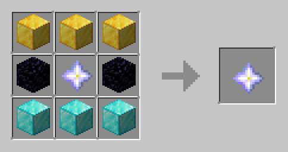

# 🌾 Custom Crafting

Custom Crafting is one of **LifestealZ**'s key features, due to its significant, it deserves a section in its own right.

### Materials

When you define custom crafting recipes, you must follow a specific naming convention. This plugin uses Spigot, so you'll need to select the materials and follow the recipes as defined below:


Spigot materials


### Customizing

To change the default crafting recipes of **LifestealZ,** open your `config.yml` file, navigate down until you find recipes, it should look something like:



```yaml
items:
  defaultheart:
    ...
    recipe:
      rowOne:
        - "GOLD_BLOCK"
        - "GOLD_BLOCK"
        - "GOLD_BLOCK"
      rowTwo:
        - "OBSIDIAN"
        - "NETHER_STAR"
        - "OBSIDIAN"
      rowThree:
        - "DIAMOND_BLOCK"
        - "DIAMOND_BLOCK"
        - "DIAMOND_BLOCK"
    ...
  ...
...
```

You can easily change up the blocks by modifying the row data. Ensuring you follow the correct namings as listed above.



<figure><figcaption></figcaption></figure>


